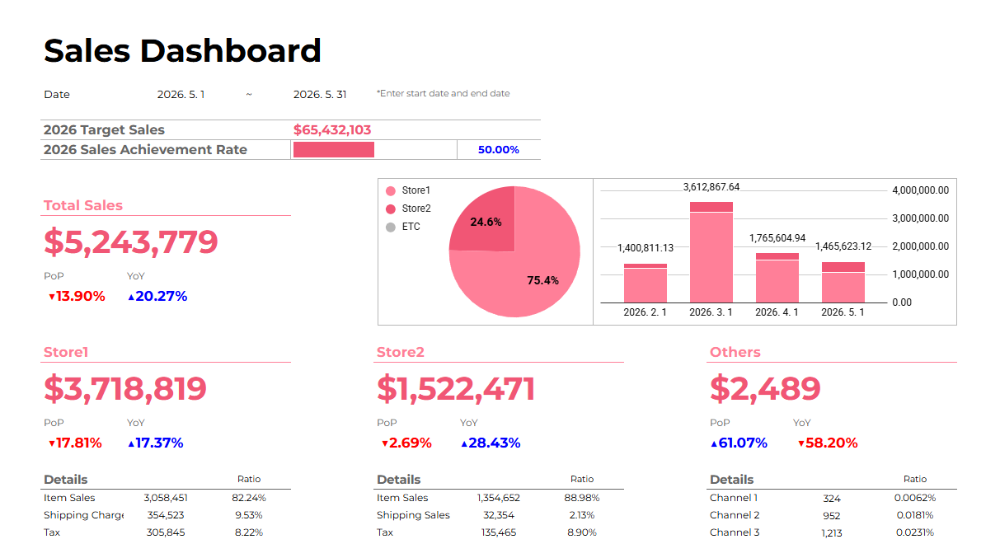
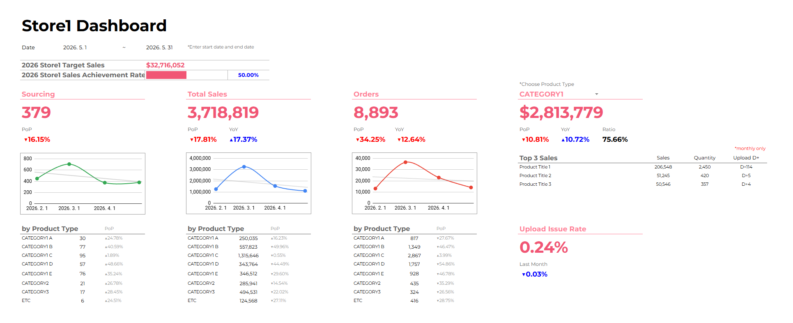

# Shopify Sales Data & Dashboard Automation

Automated daily collection of Shopify sales data into Google Sheets, replacing a manual export-and-paste workflow with a fully automated pipeline. Built and refined through iterative collaboration with Claude (Anthropic's AI assistant).

## Dashboard




## Summary

This project replaced a recurring manual data process with a fully automated one. Previously, sales metrics and category-level breakdowns were exported from Shopify's analytics reports, downloaded as files, and manually pasted into Google Sheets templates each month. This created risk of human error (missed rows, wrong paste ranges, inconsistent category grouping) and consumed real working hours every reporting cycle.

The automation now pulls daily, weekly, and monthly sales metrics, category-level sales, and top 3 best-selling products per category directly from Shopify via Google Apps Script, with no manual steps required. Anyone on the team can open the spreadsheet and see up-to-date numbers without depending on one person's manual process.

## Before / After

| | Before (Manual) | After (Automated) |
|---|---|---|
| Data collection | Export ShopifyQL report → download file → paste into sheet | Apps Script pulls data automatically every day |
| Category aggregation | Manual pivot table + spreadsheet formula for grouping | Grouping logic handled in code, applied consistently |
| Top 3 products per category | Separate report per category, manually sorted and copy-pasted | Queried and written automatically |
| Error risk | Manual paste errors, missed updates, inconsistent ranges | Consistent, code-driven, repeatable |
| Time cost | Recurring manual work every reporting cycle | Zero manual time once set up |
| Accessibility | Process knowledge held by one person | Anyone can open the sheet and see current data |

## What This Demonstrates

- **AI-assisted development**: The entire pipeline — including debugging timezone bugs, rewriting Shopify Analytics queries, and restructuring sheet write logic — was built through iterative, natural-language collaboration with Claude. See [docs/03-decisions.md](docs/03-decisions.md) for the reasoning behind key technical choices made along the way.
- **Process improvement**: Eliminated a manual, error-prone monthly task and replaced it with a system anyone on the team can rely on without needing to know how it works.
- **Data visualization / reporting**: Structured sheet outputs (daily/weekly/monthly metrics, category sales, top products) are designed to plug directly into a dashboard view.
- **Data governance**: Standardized column structures, a consistent overwrite-by-key pattern that preserves edit history instead of duplicating rows, and a documented category-grouping ruleset so the taxonomy stays consistent as products are added or removed.

## Architecture

```
Shopify Admin API / ShopifyQL (Analytics)
        │
        ▼
Google Apps Script (scheduled trigger, daily 09:00 KST)
        │
        ▼
Google Sheets
  ├─ Daily Sales                       (daily / weekly / monthly metrics)
  ├─ Sales by Product Type             (category-level sales)
  └─ Top Product by Product Type       (top 3 products per category)
```

See [docs/02-architecture.md](docs/02-architecture.md) for a more detailed breakdown of the data flow and design choices.

## Key Features

- Pulls daily, weekly, and monthly sales metrics (net sales, orders, AOV, conversion rate, new/returning/cumulative customers)
- Aggregates sales by product category, using a configurable grouping rule on top of Shopify's raw product type field
- Surfaces the top 3 best-selling products per top-level category each month
- Re-validates the last 3 days on every run to correct for Shopify analytics lag
- Automatically recomputes monthly rollups on the last day of each month
- Update-in-place logic (rather than delete-and-reappend) so edit history is preserved in Google Sheets version history
- Historical backfill scripts to populate past data when needed

## Repository Structure

```
.
├── README.md
├── assets/
│ ├── sales-dashboard.png
│ └── store1-dashboard.png
├── docs/
│ ├── 01-before-after.md
│ ├── 02-architecture.md
│ ├── 03-decisions.md
│ └── 04-troubleshooting.md
└── scripts/
├── config.js
├── daily-sync.js
├── historical-backfill.js
├── product-type-sync.js
└── setup-triggers
```

## Tech Stack

- Google Apps Script (JavaScript) — implemented through AI-assisted development with Claude (Anthropic), pairing business/data requirements with iterative code generation, debugging, and review
- Shopify Admin API / ShopifyQL (Analytics GraphQL endpoint)
- Google Sheets

## Notes

This repository is a sanitized version of a production automation. Store domains, spreadsheet IDs, and access tokens have been removed and replaced with placeholders or Script Properties references. Actual product category names have also been replaced with generic labels (`CATEGORY1`, `CATEGORY2`, `CATEGORY3`, and `CATEGORY1_A` through `CATEGORY1_E`) to avoid disclosing internal product taxonomy, while preserving the underlying grouping structure (one dominant category broken down further, the rest grouped at a higher level).
